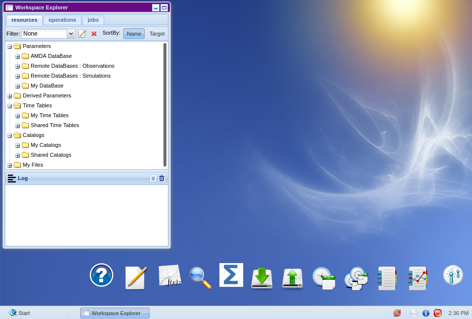

.. amdapy documentation master file, created by
   sphinx-quickstart on Fri Feb 12 12:11:41 2021.
   You can adapt this file completely to your liking, but it should at least
   contain the root `toctree` directive.

Welcome to amdapy's documentation!
==================================

:program:`amdapy` is a python package for accessing data in AMDA. It is intended for anyone interested in
manipulating heliophysics data. AMDA provides a vast collection of plasma physics datasets and
analysis tools via its web platform `AMDA <http://amda.irap.omp.eu>`_. The :program:`amdapy` package provides
an interface for those wishing to manipulate AMDA datasets in their python scripts.

Github : `https://github.com/cdppirap/amdapy <https://github.com/cdppirap/amdapy>`_.

   AMDA home page

.. toctree::
   :maxdepth: 3
   :caption: Contents:

   modules
   notebooks
   amdapy-notebook-1.ipynb

Indices and tables
==================

* :ref:`genindex`
* :ref:`modindex`
* :ref:`search`

What is amdapy ?
================

:program:`AMDA` is a collection of tools and datasets destined for research in the field to heliophysics. Through
the web plateform `AMDA <http://amda.cdpp.eu>`_ user can download datasets from a multitude of missions, 
retrieve information about instrumentation used during these missions and view the measurements. 

AMDA also provides access to simulation models and advanced vizualisation tools. For specific 
application users often have to download the data and perform the desired operations themselves.

Python is an open-source development language with a large and very active community. Reasearchers
have developed a number of packages usefull in the field of astrophysics and :program:`amdapy`
aims to fill this gap in functionality. Users familiar with datasets in AMDA can now easily 
download data as a simple python object and do with it as they please.

:program:`amdapy` makes use of AMDA's internal REST/SOAP web service protocol to deliver data to the
user.

.. warning::
   This package is still under active developement and could undergo changes at any point.

Getting started
===============

The following is an introduction to using :program:`amdapy`. We present the hierachy under which
AMDA stores its data structures and how we propose to navigate it.

Installation
------------

The current packaged version of :program:`amdapy` can be downloaded :download:`amdapy tar <../dist/amdapy-0.1.1.tar.gz>`. This package requires :program:`Python3.5` (or a later version).

Install by executing the following ::
  
  pip3 install amdapy
 
To install the package with pip from the source archive use the following::
  
  pip3 install amdapy-<version>.tar.gz

Test that the package was installed correctly by running the following in a python3 interpreter::

  >>> import amdapy
  >>> print(amdapy.__version__)
  0.1.1

The collection 
--------------

Datasets belong to a mission and an instrument and contain parameters (which we will refer to
indistinctively. As each instrument makes measurements over time all parameters are timeseries. When
refering to a parameters *size* we refer to any dimension other than time, for instance a position is of
size (or dimension) 3.

Datasets and parameters have a *unique* identifier in AMDA by which they can be retrived. The 
:meth:`amdapy.amda.Collection.find` searches the collection for an item with the corresponding id and returns
a description of that object as presented below.

.. code-block:: python
   
   >>>dataset_desc
   Dataset (id:tao-ura-sw, start:2010-01-01 00:00:00, stop:2021-02-19 00:00:00, n_param:7)
        Parameter (id:ura_sw_n, name:density, units:cm⁻³, shape: (24,))
        Parameter (id:ura_sw_v, name:velocity, units:km/s, nodata)
        Parameter (id:ura_sw_t, name:temperature, units:eV, shape: (24,))
        Parameter (id:ura_sw_pdyn, name:dynamic pressure, units:nPa, shape: (24,))
        Parameter (id:ura_sw_b, name:b tangential, units:nT, shape: (24,))
        Parameter (id:ura_sw_bx, name:b radial, units:nT, shape: (24,))
        Parameter (id:ura_sw_da, name:angle Uranus-Sun-Earth, units:deg, shape: (24,))

AMDA's web service provides the user with a XML collection that is parsed by the :class:`amdapy.amda.Collection` class. This object returns descriptions of the items belonging to the collection.
Dataset descriptions are accessed via the :class:`amdapy.amda.Collection.Dataset` class and parameters through :class:`amdapy.amda.Collection.Parameter`.

   You can find a parameters ID in the information popup when hovering a parameter in the AMDA dataset navigation tree

Getting data
------------

Let's see how to retrieve some data with a simple example by downloading the :data:`tao-ura-sw` dataset.

Interacting with AMDA is done through the connector object :class:`amdapy.amda.AMDA` : 

.. code-block:: python

   >>> from amdapy.amda import AMDA
   >>> amda = AMDA()

The user must retrieve the dataset description object (:class:`amdapy.amda.Collection.Dataset`) 
using the :meth:`amdapy.amda.Collection.find` method.

.. code-block:: python

   >>> dataset_description = amda.collection.find("tao-ura-sw")
   >>> dataset_description
   Dataset item (id:tao-ura-sw, name:SW / Input OMNI, start:2010-01-01 00:00:00, stop:2021-02-19 00:00:00, n_param:7)
        Parameter item (id:ura_sw_n, name:density, units:cm⁻³, disp:None, dataset:tao-ura-sw, n:1)
        Parameter item (id:ura_sw_v, name:velocity, units:km/s, disp:None, dataset:tao-ura-sw, n:2)
        Parameter item (id:ura_sw_t, name:temperature, units:eV, disp:None, dataset:tao-ura-sw, n:1)
        Parameter item (id:ura_sw_pdyn, name:dynamic pressure, units:nPa, disp:None, dataset:tao-ura-sw, n:1)
        Parameter item (id:ura_sw_b, name:b tangential, units:nT, disp:None, dataset:tao-ura-sw, n:1)
        Parameter item (id:ura_sw_bx, name:b radial, units:nT, disp:None, dataset:tao-ura-sw, n:1)
        Parameter item (id:ura_sw_da, name:angle Uranus-Sun-Earth, units:deg, disp:None, dataset:tao-ura-sw, n:1) 

You may now download the data :

.. code-block:: python

   >>> dataset = amda.get(dataset_description)
   >>> dataset
   Dataset (id:tao-ura-sw, start:2010-01-01 00:00:00, stop:2021-02-19 00:00:00, n_param:7)
        Parameter (id:ura_sw_n, name:density, units:cm⁻³, shape: (24,))
        Parameter (id:ura_sw_v, name:velocity, units:km/s, nodata)
        Parameter (id:ura_sw_t, name:temperature, units:eV, shape: (24,))
        Parameter (id:ura_sw_pdyn, name:dynamic pressure, units:nPa, shape: (24,))
        Parameter (id:ura_sw_b, name:b tangential, units:nT, shape: (24,))
        Parameter (id:ura_sw_bx, name:b radial, units:nT, shape: (24,))
        Parameter (id:ura_sw_da, name:angle Uranus-Sun-Earth, units:deg, shape: (24,))

The contents of the dataset are availble through the :data:`data` attribute : 

.. code-block:: python

   >>> type(dataset.data)
   <class 'pandas.core.frame.DataFrame'>

You can get individual parameters either through the bracket operator by passing the name or id
of the desired parameter or by using the :meth:`amdapy.amda.Dataset.iter_parameter` method.

.. code-block:: python

   >>> dataset["density"]
   Parameter (id:ura_sw_n, name:density, units:cm⁻³, shape: (24,))

A simple plot example : 

.. code-block:: python
   
   >>> import matplotlib.pyplot as plt
   >>> fig = dataset["density"].plot(dataset_id="tao-ura-sw")
   >>> plt.show()

   Plot *density* from *tao-ura-sw* dataset

User parameters
---------------

To retrieve the list of `derived parameters` defined by `user` execute the following::
    
   >>> user_parameters = amda.list_derived(userid="username", password="password")
   >>> for param in user_parameters:
   >>>     print(param)
   DerivedParameter (user=username, id=ws_0, name=param_0)
   ...
   DerivedParameter (user=username, id=ws_k, name=param_k)

The actual data is fetched using `amda.get` method::

   >>> data = amda.get_derived("username", "password", "ws_k", "2010-01-01T00:00:00", "2010-01-02T00:00:00")
   >>> print(data)
                       Time  ws_zaaaa
   0    2010-01-01 00:00:00    -3.678
   1    2010-01-01 00:00:16    -3.562
   ...                  ...       ...
   5397 2010-01-01 23:59:12     1.632
   5398 2010-01-01 23:59:28     1.509

   [5401 rows x 2 columns]

